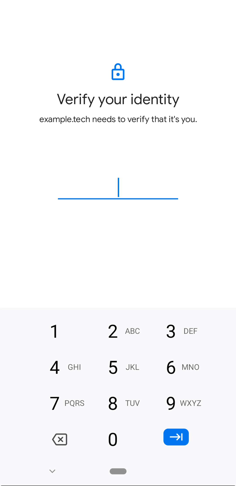
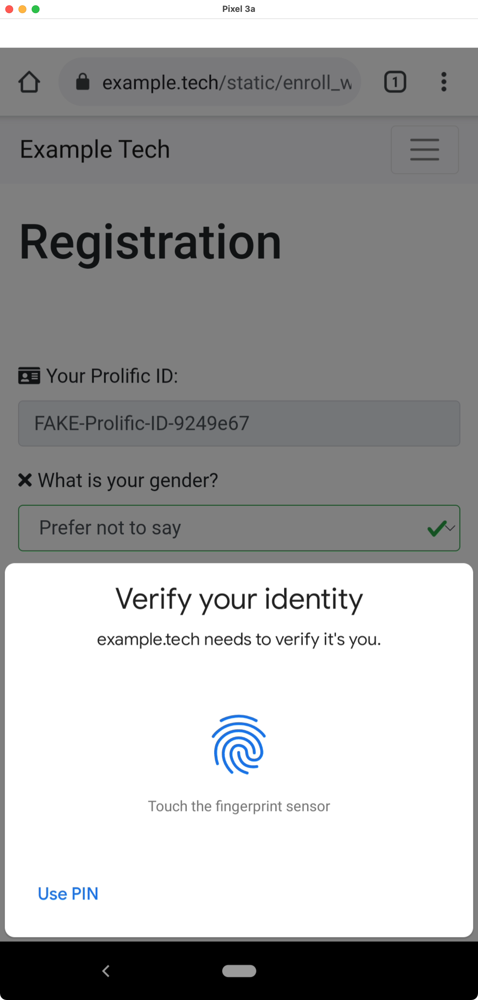

# Mitigating Users' Misconceptions About FIDO2 Biometric WebAuthn

## tl;dr
This repository hosts useful artifacts (source code and screenshots) of a research project about [**FIDO2 biometric WebAuthn**](https://fidoalliance.org/fido2/).
In our paper, we conducted three user studies and **developed notifications that can help to address misconceptions and increase the adoption** of biometric WebAuthn.

<div align="left">


</div>

## Paper
A short summary can be found at: [What users think about logging in without a password](https://news.rub.de/english/press-releases/2021-06-22-it-security-what-users-think-about-logging-without-password).
If you are interested in the details, please refer to our paper, ["It's Stored, Hopefully, on an Encrypted Server": Mitigating Users' Misconceptions About FIDO2 Biometric WebAuthn](https://www.blaseur.com/papers/fido2biometrics-extended.pdf), which appeared at the [30th USENIX Security Symposium (SSYM '21)](https://www.usenix.org/conference/usenixsecurity21/presentation/lassak).

## Notifications

### Screenshots
High-resolution screenshots of all notifications and all steps of the user study can be found in [docs/screenshots](docs/screenshots).

### A) Biometric WebAuthn
In our study, we compared the following six different notifications for biometric WebAuthn. All notifications consisted of a title, an icon, and optionally a body text.

  - Title: Fast and easy sign-in with your fingerprint or face.
  - Icon: `logo_base.png`

  1. `Biometric-Control`:
      - Body: `N/A`
  2. `Biometric-Brands`
      - Body: Backed by **Microsoft, Google, and Apple**.
  3. `Biometric-Hacked`
      - Body: Unlike passwords it **can't be hacked**.
  4. `Biometric-Leaves`
      - Body: Your fingerprint or face **never leaves** your personal device.
  5. `Biometric-Stored`
      - Body: Your fingerprint or face is **only stored** on your personal device.
  6. `Biometric-Shared`
      - Body: Your fingerprint or face is **never shared** with ExampleTech or third parties.

<div align="left">


</div>

### B) Non-biometric WebAuthn
We also tested a notification for non-biometric WebAuthn consisting of a title and an icon.

  - Title: Fast and easy sign-in with your device's **PIN, pattern, or password**.
  - Icon: `logo_fallback.png`
  - Body: `N/A`

<div align="left">



</div>

### C) Traditional Password
In our traditional password condition, participants saw no notification but were directly forwarded to the password registration form.

  - Title: `N/A`
  - Icon: `N/A`
  - Body: `N/A`

<div align="left">


</div>

## Technical Documentation
The PHP/JavaScript/HTML/CSS code in this repository is a slight modification of the code that has been used in **Study 3** (cf. [Section 5](https://www.blaseur.com/papers/fido2biometrics-extended.pdf)). If you run this code, you can test our developed notifications and authenticate using (biometric) WebAuthn or traditional passwords.

Our PHP code relies on the [**PHP WebAuthn Framework**](https://github.com/web-auth/webauthn-framework) developed by [Spomky-Labs (Florent Morselli)](https://github.com/Spomky). The framework's documentation will soon become your new best friend, so you should bookmark it [webauthn-doc.spomky-labs.com](https://webauthn-doc.spomky-labs.com/).

The flow of this user study demo is outlined in the following screenshots. Note that participants in our study did not see the Debug Menu and were redirected to Qualtrics once they successfully registered.

### User Study Demo Flow
<div align="left">





</div>

### Security
**Warning**: This is a proof of concept (PoC) implementation and not intended to be used in a production environment.
We use Prepared Statements and PHP Data Objects (PDO) to execute SQL statements. We make use of `intval()`, `floatval()`, `htmlspecialchars(... ENT_QUOTES | ENT_SUBSTITUTE)`, and `json_encode/decode()` to sanitize user input. Passwords are insecurely stored in plaintext in the database (because we analyzed them in our paper using [CMU's Password Guessability Service](https://pgs.ece.cmu.edu)).

### Requirements
* A common [LAMP stack](https://www.digitalocean.com/community/tutorials/how-to-install-linux-apache-mysql-php-lamp-stack-on-ubuntu-20-04-quickstart).
  - We used Apache 2.4, PHP 7.4, and MySQL 8 on Ubuntu 20.04.
* **You need a domain and a TLS certificate** (WebAuthn enforces this and will not work over plain `HTTP`).
  - You can get a TLS certificate for free using [Let's Encrypt](https://www.digitalocean.com/community/tutorials/how-to-secure-apache-with-let-s-encrypt-on-ubuntu-20-04).
  - For local development, you might want to use [`mkcert`](https://github.com/FiloSottile/mkcert).
* You need to install the following packages using [Composer](https://getcomposer.org/download/).
```sh
composer require web-auth/webauthn-lib
composer require symfony/http-foundation
composer require symfony/psr-http-message-bridge ^1.3.0
composer require zendframework/zend-diactoros
```

#### All Treatments
* Required: **Google Chrome** (currently commented out for easier testing). We used [UAParser.js](https://github.com/faisalman/ua-parser-js) for this.
  - `location.href = 'help_aw.php?d1=wrongbrowser'` -> Redirect to help page.
* Required: **Android >= v7** (Nougat) (currently commented out for easier testing). We used `navigator.userAgent.indexOf("Android") > -1;`
  - `location.href = 'help_aw.php?d1=notandroid'` -> Redirect to help page.
* Required: **WebAuthn support and a screen lock** on the device (`if (window.PublicKeyCredential) {}`)
  - `location.href = 'help_aw.php?d1=wrongbrowser'` -> Redirect to help page.
  - **NotSupportedError**: The specified `userVerification` requirement cannot be fulfilled by this device unless the device is secured with a screen lock.
* Maximum of **3 attempts** each (registration & authentication). Enforced via the backend.
  - ⚠️ Registration failed. Please try again!
  - ⚠️ Authentication failed. Please try again!

#### Traditional Password
* **Composition Policy:** **>= 8 chars** and minimum password strength of **zxcvbn score >= 3** (guess_number >= 10^8 guesses)
  - Must be at least 8 characters long.
  - ❌ Your password is not long enough.
* [zxcvbn password **strength meter**](https://github.com/dropbox/zxcvbn) (bar + text + emoji)
  - length < 8: 😵 **That's too short**. You need at least 8 characters.
  - score 0 || 1: 😟 **Terrible**. This password is very easy to guess.
  - score 2: 😐 **Weak**. Your password needs to be better.
  - score 3: 🙂 **Good**. Your password is pretty good.
  - score 4: 😇 **Excellent**. Your password appears strong.
* Minimal custom **blocklist**: `['Example Tech', 'example', 'Example.Tech', 'example.tech', 'Study', 'Prolific'];`
* [Support for **password managers**](https://www.chromium.org/developers/design-documents/form-styles-that-chromium-understands) (`autocomplete="new-password"`)
* Option to **display password** in plaintext (`.on('touchstart'` and `.on('mousedown'`))
* Password **confirm field**
  - ❌ Passwords do not match. Check them for typos.

#### Biometric/Non-biometric WebAuthn
* **timeout:** `60000`, we require the user to respond within 60 seconds.
* **userVerification:** `required`, users are forced to enter the device PIN/provide a biometric.
  - **NotAllowedError**: The operation either timed out or was not allowed.
* **authenticatorAttachment:**  `platform`, only platform authenticators (`AUTHENTICATOR_ATTACHMENT_PLATFORM`) were allowed in the study, aka only Android devices, no third-party NFC/Bluetooth/USB hardware security keys (currently set to `AUTHENTICATOR_ATTACHMENT_NO_PREFERENCE` for easier testing).
* **attestation:** `none`, no attestation required. We don't care from where the keys originate.
* **requireResidentKey:** `false`, no resident keys/discoverable credentials are used.

### WebAuthn Support and Error Situations:
Please make sure first to verify whether the device supports WebAuthn. This can be achieved using the following code snippet (from `js/custom/register_webauthn.js`):
```javascript
// Check whether WebAuthn is supported by the user agent
if (window.PublicKeyCredential) {
    console.log("WebAuthn is supported");
} else {
  ...
}
```

Below is a list of other error situations that might result from calling `navigator.credentials.create()` and `navigator.credentials.get()` that you would want to consider:

- **NotSupportedError**: The specified `userVerification` requirement cannot be fulfilled by this device unless the device is secured with a screen lock.
  - Potential reason: User does not have a screen lock configured on their device.
- **NotAllowedError**: The operation either timed out or was not allowed.
  - Potential reason: User denied or did not respond within our set timeout of 60 seconds.
- **InvalidStateError**: A request is already pending.
  - Potential reason: The device is too slow/the user pressed the login button multiple times. Can be prevented with better callback handling.
- **NotReadableError**: An unknown error occurred while talking to the credential manager.
  - Potential reason: Unknown.

### Changing WebAuthn Settings
Please edit `static/enroll_w.php`.

* [Register Authenticators](https://webauthn-doc.spomky-labs.com/the-webauthn-server/the-hard-way/authenticator-registration#creation-request):
You can change **timeout** to any value (in milliseconds).

```php
$timeout = 60000; // 60 seconds
```

* [Authenticator Selection Criteria](https://webauthn-doc.spomky-labs.com/deep-into-the-framework/authenticator-selection-criteria):
You can change **authenticatorAttachment** from `AUTHENTICATOR_ATTACHMENT_NO_PREFERENCE` (UI will ask which authenticator to use) and `AUTHENTICATOR_ATTACHMENT_PLATFORM` (UI will prompt for screen lock).

* [Resident Key](https://webauthn-doc.spomky-labs.com/deep-into-the-framework/authenticator-selection-criteria#resident-key):
You can change **requireResidentKey** from `false` to `true`.

* [User Verification](https://webauthn-doc.spomky-labs.com/deep-into-the-framework/user-verification):
You can change **userVerification** from `USER_VERIFICATION_REQUIREMENT_REQUIRED` to `USER_VERIFICATION_REQUIREMENT_DISCOURAGED`.


```php
$authenticatorSelectionCriteria = new AuthenticatorSelectionCriteria(
    AuthenticatorSelectionCriteria::AUTHENTICATOR_ATTACHMENT_PLATFORM,     // Platform authenticator
    false,                                                                 // Resident key required
    AuthenticatorSelectionCriteria::USER_VERIFICATION_REQUIREMENT_REQUIRED // User verification required
);
```

### Creating the MySQL Database

To edit the database name, user, and password, please refer to `includes/lib/db_connection.php`.

```SQL
CREATE DATABASE `bio_webauthn_db`;
ALTER SCHEMA `bio_webauthn_db` DEFAULT CHARACTER SET utf8;
CREATE USER 'bio_webauthn_user'@'%' IDENTIFIED BY 'some-fake-password-replace-me'; # You need to change this!!!
GRANT SELECT, INSERT, UPDATE ON `bio_webauthn_db`.* TO 'bio_webauthn_user'@'%';

FLUSH PRIVILEGES;

DROP TABLE bio_webauthn_db.webauthn_registrations;
DROP TABLE bio_webauthn_db.webauthn_authentications;
DROP TABLE bio_webauthn_db.password_registrations;
DROP TABLE bio_webauthn_db.password_authentications;
DROP TABLE bio_webauthn_db.ui_actions;

CREATE TABLE webauthn_registrations (
    uid INT NOT NULL AUTO_INCREMENT PRIMARY KEY,
    prolific VARCHAR(64) NOT NULL,
    username VARCHAR(64) NOT NULL,
    notification VARCHAR(64) NOT NULL,
    attempt INT NOT NULL,
    gender VARCHAR(64) NOT NULL,
    age INT NOT NULL,
    ui_timespan INT NOT NULL,
    date_reg TIMESTAMP DEFAULT CURRENT_TIMESTAMP NOT NULL,
    raw_id VARCHAR(256) NOT NULL,
    json_parsed VARCHAR(4096) NOT NULL,
    json_raw VARCHAR(4096) NOT NULL,
    useragent VARCHAR(512) NOT NULL,
    ip VARCHAR(64) NOT NULL
) ENGINE=InnoDB;

CREATE TABLE webauthn_authentications (
    uid INT NOT NULL AUTO_INCREMENT PRIMARY KEY,
    prolific VARCHAR(64) NOT NULL,
    username VARCHAR(64) NOT NULL,
    notification VARCHAR(64) NOT NULL,
    attempt INT NOT NULL,
    ui_timespan INT NOT NULL,
    date_auth TIMESTAMP DEFAULT CURRENT_TIMESTAMP NOT NULL,
    json_parsed VARCHAR(4096) NOT NULL,
    json_raw VARCHAR(4096) NOT NULL,
    useragent VARCHAR(512) NOT NULL,
    ip VARCHAR(64) NOT NULL
) ENGINE=InnoDB;

CREATE TABLE password_registrations (
    uid INT NOT NULL AUTO_INCREMENT PRIMARY KEY,
    prolific VARCHAR(64) NOT NULL,
    notification VARCHAR(64) NOT NULL,
    attempt INT NOT NULL,
    ratelimit INT DEFAULT 0,
    gender VARCHAR(64) NOT NULL,
    age INT NOT NULL,
    ui_timespan VARCHAR(8192) NOT NULL,
    date_reg TIMESTAMP DEFAULT CURRENT_TIMESTAMP NOT NULL,
    password VARCHAR(512) NOT NULL,
    strength VARCHAR(64) NOT NULL,
    useragent VARCHAR(512) NOT NULL,
    ip VARCHAR(64) NOT NULL
) ENGINE=InnoDB;

CREATE TABLE password_authentications (
    uid INT NOT NULL AUTO_INCREMENT PRIMARY KEY,
    prolific VARCHAR(64) NOT NULL,
    notification VARCHAR(64) NOT NULL,
    attempt INT NOT NULL,
    ui_timespan VARCHAR(8192) NOT NULL,
    date_auth TIMESTAMP DEFAULT CURRENT_TIMESTAMP NOT NULL,
    useragent VARCHAR(512) NOT NULL,
    ip VARCHAR(64) NOT NULL
) ENGINE=InnoDB;

CREATE TABLE ui_actions (
    aid INT NOT NULL AUTO_INCREMENT PRIMARY KEY,
    prolific VARCHAR(64) NOT NULL,
    action_log VARCHAR(4096) NOT NULL,
    useragent VARCHAR(512) NOT NULL,
    ip VARCHAR(64) NOT NULL
) ENGINE=InnoDB;
```

## BibTeX

If you want to cite our work, please use the following BibTeX entry:

```BibTeX
@inproceedings{lassak-21-webauthn-misconceptions,
    author = {Lassak, Leona and Hildebrandt, Annika and Golla, Maximilian and Ur, Blase},
    title = {{``It's Stored, Hopefully, on an Encrypted Server'': Mitigating Users' Misconceptions About FIDO2 Biometric WebAuthn}},
    booktitle = {USENIX Security Symposium},
    year = {2021},
    series = {SSYM~'21},
    pages = {91--108},
    address = {Virtual Conference},
    month = aug,
    publisher = {USENIX}
}
```

## License

The source code in this repository is licensed under the **MIT license**. Refer to [docs/LICENSE](docs/LICENSE) for more information.

### Third-Party Libraries
#### PHP
* **PHP WebAuthn Framework** is developed by [Spomky-Labs (Florent Morselli) and other contributors](https://github.com/Spomky). The license and the source code can be downloaded
[here](https://github.com/web-auth/webauthn-framework).

#### JavaScript
* **zxcvbn** is developed by [Dan Wheeler, Dropbox, and other contributors](https://github.com/dropbox). The license and the source code can be downloaded
[here](https://github.com/dropbox/zxcvbn/blob/master/LICENSE.txt).
* **UAParser** is developed by [Faisal Salman and other contributors](https://github.com/faisalman). The license and the source code can be downloaded
[here](https://github.com/faisalman/ua-parser-js/blob/master/license.md).
* **Lockr** is developed by [Dimitris Tsironis and other contributors](https://github.com/tsironis). The license and the source code can be downloaded
[here](https://github.com/tsironis/lockr/blob/master/LICENSE).
* **jQuery** is developed by the [JS Foundation and other contributors](https://github.com/jquery). The license and the source code can be downloaded
[here](https://jquery.org/license/).

#### Cascading Style Sheets
* **Font Awesome Free** is developed by [FortAwesome and other contributors](https://github.com/FortAwesome). The license and the source code can be downloaded
[here](https://fontawesome.com/license/free).
* **Bootstrap** is developed by [Twitter and other contributors](https://github.com/twbs). The license and the source code can be downloaded
[here](https://github.com/twbs/bootstrap/blob/main/LICENSE).

## Contact
Visit [SUPERgroup](https://super.cs.uchicago.edu), [Ruhr University Bochum](https://casa.rub.de), or the [MPI-SP](https://mpi-sp.org). If you are interested in authentication, consider contributing and attending the [Symposium on Usable Privacy and Security (SOUPS)](https://www.usenix.org/conference/soups2021) and [International Conference on Passwords (PASSWORDS)](https://passwordscon.org).
